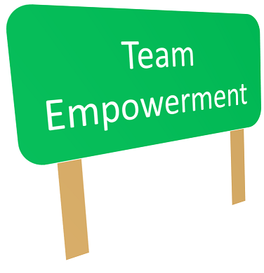
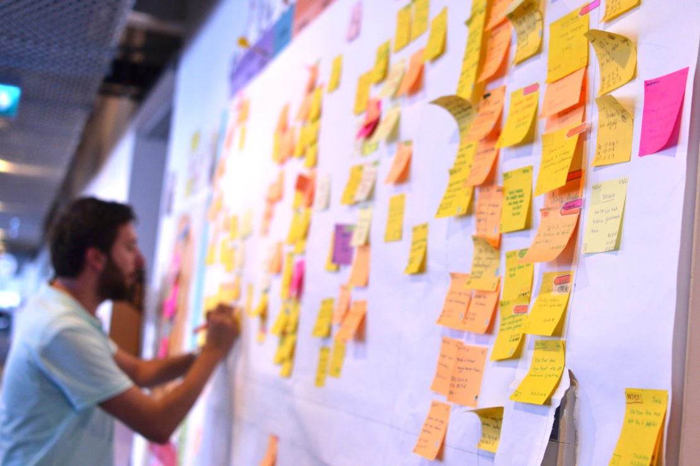

# Emotional Engagement in an Agile Transformation

 <!-- title: Emotional Engagment in an Agile Transformation -->
 
 
 
- [Emotional Engagement in an Agile Transformation](#emotional-engagement-in-an-agile-transformation)
- [Basics of an Agile Framework](#basics-of-an-agile-framework)
  - [References](#references)
  - [Github](#github)

We all experienced organizations where agile was implemented as a dry project management tool. When it's only about process and metrics, the teams will just push back against this perceived overheads, delaying or stopping the transformation altogether.

Teams are made up of individuals who need to believe in what they are doing. 
They need to be emotionally engaged in the transformation - i.e. why it benefits them, more than just their managers.

We emotionally engage players in this transformation by articulating a vision:

> "We aspire to be autonomous by self-organizing around our goals, and designing our work to accomplish shared objectives larger than us."

Striving to be autonomous will engender a *culture* that promotes these attributes:

**Self-Driven**

- Collaborate on a known objective every day and drive/support all teams to achieve this objective.
- Not reactive, because the work and end-goals are known.
- Have autonomy over the work whose output aligns with the Company's goals.

**Ingrained Mutual Trust**

- Comfortable to innovate, ideate and communicate.
- Members are inclusive and highly engaged in collaboration with each other and their neighboring teams.
   
**Team-Member-Driven**

- A designed work processes and environment that enables everyone to be a top-performer.
- Members are equal partners at decision-making as at development-level, everyone's input is relevant - regardless of position, team or title.
- Team achieved the organization's trust to make informed decisions and produce value within  their space (collocated or distributed). 
- Every team has the freedom to write their own work agreements, to assign members different tasks within the team and set their aspects and duties within the team. 

**Strong Communication**

- Teams prioritize open and rich communication (high-fidelity and face-to-face for rich interactions) and radiate their ideas, progress and achievements to the whole organization.
- Teams value a written culture, making all their ideas and decisions permanent and scale-able.

**Self-Aware**

- Teams and their members are aware of their gaps and work to improve these, being in people, process or product.
- Teams have control over the allocation of our resources and implement measurements that gives us insights.

**Act as An Organization**

- None operate as silos - there are no responsibility boundaries and no us versus them.
- All have shared goals for collaboration and operate as a cohesive group of professionals.

Being self organized will give freedom to the teams to manage their hours, workload and ameliorate everyone's work-life balance, because it gives visible value to the organization. 
To arrive to this point, the teams need to work in an Agile framework - or at least practice the basics.

# Basics of an Agile Framework

Without subscribing to any framework's process and vocabulary, these are the basic attributes that are pertinent within an agile development team:

**Structured Work**

- Tasks are continuously refined until these pass the Definition of Ready (DOR) quality bar, this means: Work has a visible link to business value.
- Work context and expectations are clear.
- Work is deconstructed to quantifiable and easily deliverable set of items
- Measurements are defined to assess the work and the value it has delivered, this includes non-functional requirements.
- Development teams always know the big picture.
- Development teams do not get overwhelmed with unnecessary work, work that is a result of waste, bad engineering, bad management and/or bad requirements.
- Work will be completed once picked up, with intent and success. Passing the defined Definition of Done (DoD). Work in Progress (WIP) is kept to the minimum.

**Valuable Ceremonies and Deliverables**

- When a meeting is required, it has an intent and a time frame. 
- Dailies are performed - these are short check-ins on who is working on what, knowledge sharing and impediment removal. 
- Planning meeting is done before each iteration to define what next piece of business increment the devs will work towards achieving. 
- Reviews and retrospectives at each event (a delivery or iteration) are scheduled. Here actionable feedback and ideas are generated while working demos are displayed and work progress and backlog is reviewed.
- Teams use metrics, tools and activities that lead to visibly increased value in what the team delivers.
- Deliveries are incremental and visible. Deliverables align to the organizations plans and needs.

**Transparent, Inclusive and Predictable**

- All work, state of work, divergence or blockers are highly visible.
- The effort the teams invests is quantifiable and can be communicated.
- Knowledge, tools and solutions are freely available to others to for their own use.

Just like any human interaction and exchange,  there needs to be visible gain for both parties and enthusiasm. For Agile teams, this is the control and ownership of their work, effort, time and schedule. 

A happy team is a productive team.

## References

- [Self-organizing Scrum teams - Challenges and Strategies](https://agilealliance.org/wp-content/uploads/2016/01/Self-organizing-Scrum-teams-Challenges-and-Strategies.pdf)
- [How to Emotionally Engage Your Employees](https://www.knowledgecity.com/blog/how-to-emotionally-engage-your-employees-and-set-your-organization-up-for-success/)

## Github

Code and article shown here are available on [github](https://github.com/adamd1985/articles/tree/main/emotional_engagement_in_agile).

#

Made with :heartpulse: by <b>Adam</b>

