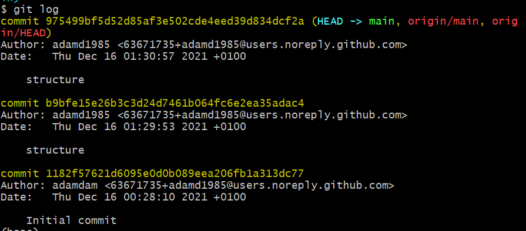
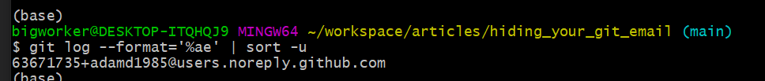
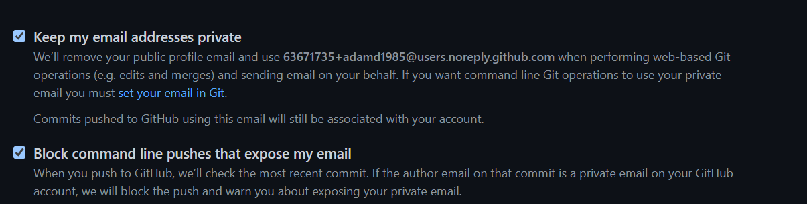

# Public Git Commits might Reveal Your Personal Email

In git, to upload your code, you need some form of identification usually in the form of an email and/or username. 
In the gitbash, you set it up like so:

```bash
git config --global user.email dummy@dummymail.com
git config --global user.name dummyuser
```

You can list this info `git config --list` or go to the _~/.gitconfig_ file to see and alter these:
```bash
[user]
        email = dummy@dummymail.com
        name = dummyuser
```

Both these peices of data link to your github/bitbucker account and attribute your actions to your account.

When you add your code, and then commit, this information is stored in the git log.
If you run the command: `git log`, this is what you see:



## Sneaky Scrapes

When I set my github account, I made sure my private email was hidden.

But lately, some sneaky email scraper, managed to get this info, and spam me with their solicitations.

How did they do it - they crawled through all public repos and ran this command:

`git log --format='%ae' | sort -u`

This it what it shows, smart of them:



Note that I have used the **dummy email** provided by github, more on this in the next section.

## Obfuscate your commits

Github offers tools to hide our info.

Go to your [profile settings](https://github.com/settings/emails), in this page you will see these 2 options:

- **Keep my email addresses private**: Github creates dummy emails for you. As shown above.
- **Block command line pushes that expose my email**: Makes sure you do not push any private information.




Enabling the above will require changes to our gitbash or ides.  
We need to set our email to the random email offered by github, using `git config --global user.email RANDOM_EMAIL`


## Github

Article here is available on [github](https://github.com/adamd1985/articles/tree/main/hiding_your_git_email).

#
<div align="right">
<p xmlns:cc="http://creativecommons.org/ns#" xmlns:dct="http://purl.org/dc/terms/"><a property="dct:title" rel="cc:attributionURL" href="#">This Article</a> by <a rel="cc:attributionURL dct:creator" property="cc:attributionName" href="https://www.linkedin.com/in/adam-darmanin/">Adam Darmanin</a> is licensed under <a href="http://creativecommons.org/licenses/by-nc-sa/4.0/?ref=chooser-v1" target="_blank" rel="license noopener noreferrer" style="display:inline-block;">CC BY-NC-SA 4.0</a></p>
</div>