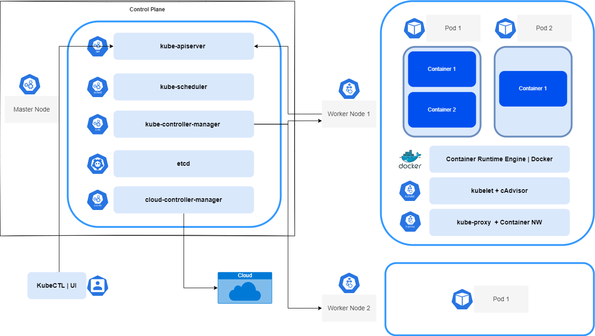

# Kubernetes - Your First Steps into Power and Scale

 <!-- title: Kubernetes - First Steps into Power and Scale -->


## The Orchestrator that Drives the world

Kuberenetes, or **K8S** as known amoungst _l33t techies_, is a container execution engine that is the defacto backbound of any scalable IT infrascructure out there. 

In this article, we will go through some of its concepts and run our own personal kubernetes to get a feel of technology.

# K8S Components and Key Processes

A picture says a thousand words, so let's start with that:



There are 2 major groups in a K8S cluster: masters and workers.

## The Masters

A master is a node that sits in the control plane and has access to the cluster. Masters usually come in odd numbers or a recommended quorum of `Nodes/2 + 1`, as they need to be able to elect 1 master to control all, and they do this by voting. If they had even numbers, they would come to a situation known as split-brain, were a sinle master cannot be elected.

Although scale and highly availability is a thing, masters operate in a **active-passive multi-master model**, which means there shall be ONLY ONE! The passive masters only proxy requests to the active leader.

### A Master's Components

1. **kube-apiserver**: API frontend of the control plane. It is responsible for handling external and internal requests. It can be accessed via the *kubectl* CLI or REST calls.

2. **kube-scheduler**: Schedules pods on specific nodes according to  workflows and user defined conditions.

3. **kube-controller-manager**: A control loop that monitors and regulates the state of a Kubernetes cluster. By receiving information about the current state it can send instructions to move the cluster towards the desired state. 

4. **etcd**: A fault-tolerent key-value database that contains data about states and configuration.

## The Workers

Sometimes called the data plan, these are nodes (aka VMs or another other form of compute) which get work scheduled to them. These nodes run pods as part of the K8S cluser, which itself can scale up to 5000 nodes.

### A Worker's Components

1. **Pods**: A single application instance, and the smallest unit in Kubernetes. Each pod consists of one or more tightly coupled containers.

2. **Container Runtime Engine**: Docker, though there are other alternatives.

3. **kubelet**: Sometimes used interchangably with node, this is a small application that can communicate with the Kubernetes control plane. 

4. **kube-proxy**: A network proxy that facilitates Kubernetes networking services. It handles all network communications outside and inside the cluster.

# Testing a Local K8S

Now that you know what does what in K8S, let's install a local K8S cluster and run stuff on it - aka The Fun Part of this article.

## Spinning a Cluster

To embark on this journey, we will install 2 tools (assuming you are on windows and have chocolately):
- kubectl: `choco install kubectl` - the main tool to interact with the cluster.
- minikube `choco install minikube` - a simple local k8s on your conatiner/vm manager (e.g. Docker, Hyper-V, VirtualBox).
- Helm (OPTIONAL): `choco install kubernetes-helm` - A package manager for k8s-ready software.

We can kickoff a small cluster with command below, which will create a cluser of 2 nodes with some limits to our host:

`minikube start --memory 8192 --cpus 2`

Here is a dockerfile which has a simple nodejs server:
```dockerfile
FROM node:alpine3.15

COPY ./app /app
RUN cd /app; npm install
EXPOSE 8080

CMD cd /app && npm star
```

Build it:
`docker build -t helloworld:1 .`

Test it (access your localhost:8080):
`docker run --rm -d -p 8080:8080 --name=helloworld helloworld:1`

and stop it:
`docker stop helloworld`

To test k8s we can skip pushing to a registry. We do this by running the commond in minikube `minikube docker-env`, this prints out this:
```bash
export DOCKER_TLS_VERIFY="1"
export DOCKER_HOST=”tcp://172.17.0.2:2376"
export DOCKER_CERT_PATH=”/home/user/.minikube/certs”
export MINIKUBE_ACTIVE_DOCKERD=”minikube”

# To point your shell to minikube’s docker-daemon, run:
# eval $(minikube -p minikube docker-env)
# & minikube -p minikube docker-env --shell powershell | Invoke-Expression
```
According to your operating system, point your sheel to the docker daemon as show above. Build again the image using the `docker build` from above, this will place the image in the minikube registry which you can use with the pods.

With K8S we have 2 methods of deploying pods: Imperative and Declerative.

### Imperative Pods

Let's build the pod using: `kubectl run helloworld --image='helloworld:1'`. Checking it with the command `kubectl get pods helloworld` gives us this:

```bash
NAME         READY   STATUS    RESTARTS   AGE
helloworld   1/1     Running   0          34m
```
Or a more in depth check using the command `kubectl describe pod helloworld`:
```yaml
Name:         helloworld
Namespace:    default
Node:         minikube/192.168.49.2
...
Containers:
  helloworld:
    Container ID:   docker://1060f41d6764342dcfdf3234e12f3c70164f74a884fdb6b19f2e5e1407514d47
    Image:          helloworld:1
    Image ID:       docker://sha256:a5054ae07993d2a0583f1b4787be40a28c3b2be7a2aa9cc026f21ab5e9c214ba
    ...
Conditions:
  Type              Status
  Initialized       True
  Ready             True
  ContainersReady   True
  PodScheduled      True
...
Events:
  Type    Reason     Age   From               Message
  ----    ------     ----  ----               -------
  Normal  Scheduled  18m   default-scheduler  Successfully assigned default/helloworld to minikube
  Normal  Pulled     18m   kubelet            Container image "helloworld:1" already present on machine
  Normal  Created    18m   kubelet            Created container helloworld
  Normal  Started    18m   kubelet            Started container helloworld
```

Then expose the pod: `kubectl expose pod helloworld --type=NodePort --port=8080`
Run `kubectl get svc helloworld` to get this info (note the no external IP):

```bash
NAME         TYPE       CLUSTER-IP      EXTERNAL-IP   PORT(S)          AGE
helloworld   NodePort   10.99.103.128   <none>        8080:32023/TCP   4m51s
```

We need the public IP to access this pod, luckily minkube provides its through the command: `minikube service helloworld --url`. browsing to this url will give you this site below:


With all this done, let's clean up all items created. First we list these items with the command `kubectl get all`, which prints this:

```bash
NAME             READY   STATUS    RESTARTS   AGE
pod/helloworld   1/1     Running   0          39m

NAME                 TYPE        CLUSTER-IP      EXTERNAL-IP   PORT(S)          AGE
service/helloworld   NodePort    10.99.103.128   <none>        8080:32023/TCP   23m
service/kubernetes   ClusterIP   10.96.0.1       <none>        443/TCP          56m
```

We have a service and a pod for helloworld. Let's delete these:
- `kubectl delete services helloworld`
- `kubectl delete pods helloworld`

Run `kubectl get all` and your cluster is now all clean.

### Declerative Pods

Declerative is the proper way to do things, and leads to proper automation and consistency of setups.

YAML files are the bread and butter of this method of setup, starting with the deployment file here (note the 5 replica sets vs the 1 we initially had above):

```yaml
apiVersion: apps/v1
kind: Deployment
metadata:
  name: helloworld
  labels:
    app: helloworld
spec:
  replicas: 5
  selector:
    matchLabels:
      app: helloworld
  template:
    metadata:
      labels:
        app: helloworld
    spec: 
      terminationGracePeriodSeconds: 1
      containers:
      - name: helloworld
        image: helloworld:1
        ports:
          - containerPort: 8080
        resources:
          requests:
            memory: "64Mi"
            cpu: "250m"
          limits:
            memory: "128Mi"
            cpu: "500m"

```
This file is deployed using the command: `kubectl apply -f .\pod.yml`. Use the same checks in the above section to verify the pod, or check the deployment itself and the replicas, with the command: `kubectl describe deployments helloworld`:

```bash
Name:                   helloworld
Namespace:              default
Labels:                 app=helloworld
Selector:               app=helloworld
Replicas:               3 desired | 3 updated | 3 total | 3 available | 0 unavailable
StrategyType:           RollingUpdate
RollingUpdateStrategy:  25% max unavailable, 25% max surge
Pod Template:
  Labels:  app=helloworld
  Containers:
   helloworld:
    Image:      helloworld:1
    Port:       8080/TCP
    Host Port:  0/TCP
 ...
Conditions:
  Type           Status  Reason
  ----           ------  ------
  Available      True    MinimumReplicasAvailable
  Progressing    True    NewReplicaSetAvailable
OldReplicaSets:  <none>
NewReplicaSet:   helloworld-6b845f4659 (3/3 replicas created)
Events:
  Type    Reason             Age   From                   Message
  ----    ------             ----  ----                   -------
  Normal  ScalingReplicaSet  115s  deployment-controller  Scaled up replica set helloworld-6b845f4659 to 5
```

Note that 3 replicas of our webapp are in the cluster. Since we have multiple pods serving the same app, we cannot use a direct NodePort anymore, we will need a **loadbalancer**.

Luckily for us we have a loadbalancer deployment file right here (note the app name and labels it will affect):
```yaml
apiVersion: v1
kind: Service
metadata:
  name: helloworld-lb
  labels:
    app: helloworld
spec:
  type: LoadBalancer
  ports:
  - port: 8080
    targetPort: 8080
  selector:
    app: helloworld
```

Deploye this service using the command: `kubectl apply -f .\service-lb.yml`, and check that everything is good by running the command: `kubectl get svc helloworld-lb`, which will show us this:

```bash
NAME            TYPE           CLUSTER-IP       EXTERNAL-IP   PORT(S)          AGE
helloworld-lb   LoadBalancer   10.108.238.242   <pending>     8080:32694/TCP   6s
```
 
And what's this, the external IP is pending? Loadbalancecr is not a NodePort mapping, so we don't have a url to a node to use. In our case, we need `minikube tunnel`. This exposes all services of type **LoadBalancer** - though you need to keep it opened in a seperate window as it's a long running CLI service.

With tunnel running, executing the command: `kubectl get svc helloworld-lb`, which will show us a different result with an external port we can use:

```bash
NAME            TYPE           CLUSTER-IP       EXTERNAL-IP   PORT(S)          AGE
helloworld-lb   LoadBalancer   10.108.238.242   127.0.0.1     8080:32694/TCP   3m39s
```

Going to 127.0.0.1:8080 will hit one of the nodes, the web page will show an IP of one of these (run with command: ` kubectl get pods -o wide`):

```bash
NAME                                 READY   STATUS    RESTARTS   AGE   IP           NODE       NOMINATED NODE   READINESS GATES
helloworld-deploy-6b845f4659-fbvbq   1/1     Running   0          10m   172.17.0.5   minikube   <none>           <none>
helloworld-deploy-6b845f4659-msvch   1/1     Running   0          10m   172.17.0.6   minikube   <none>           <none>
helloworld-deploy-6b845f4659-sc5st   1/1     Running   0          17m   172.17.0.4   minikube   <none>           <none>
```

To truly test the loadbalancer and K8S self healing capabilities, try to delete the current hosted node using the command: `kubectl delete pods [NODE-NAME]` - you will need to replace the name with the ones in the name column of the results from ` kubectl get pods -o wide`. Everytime you delete a node, you can follow its status with the command: `kubectl get rs -o wide` which should show this:

```bash
NAME                           DESIRED   CURRENT   READY   AGE   CONTAINERS   IMAGES         SELECTOR
helloworld-deploy-6b845f4659   3         3         3       26m   helloworld   helloworld:1   app=helloworld,pod-template-hash=6b845f4659
```

To see all endpoint affected by the loadbalance service, run the command `kubectl get ep -o wide`:

```bash
NAME            ENDPOINTS                                         AGE
helloworld-lb   172.17.0.4:8080,172.17.0.5:8080,172.17.0.6:8080   8m12s
kubernetes      192.168.49.2:8443                                 143m
```

# Take the Helm!

We are not yet done. In the tooling section we mentioned an optional tool called **Helm**. Help is a package manager that allows you to save and reinstall entire configurations.

Start by creating an empty helm chart: `helm create helloworldchart`. This will create a tree of template files in your folder. If you open one, they all look like your service and deployment yamls, with one difference - these come with parameterized values.

Every helm tree starts with a chart file, in our case this is what we need to put in the *Chart.yml*:
```yml
apiVersion: v2
name: helloworldchart
description: A Helm chart for Kubernetes article.

type: application
version: 0.1.0
appVersion: "1.16.0"
```

We hava a deployment.yaml (note the parameterization here):
```yaml
apiVersion: apps/v1
kind: Deployment
metadata:
  name: helloworld-deploy
  labels:
    app: helloworld
spec:
  replicas: {{ .Values.replicaCount }}
  selector:
    matchLabels:
      app: helloworld
  template:
    metadata:
      labels:
        app: helloworld
    spec:
      terminationGracePeriodSeconds: 1
      containers:
        - name: helloworld
          image: {{ .Values.image }}
          ports:
            - containerPort: {{ .Values.port }}
          resources:
            requests:
              memory: {{ .Values.resources.requests.memory }}
              cpu: {{ .Values.resources.requests.cpu }}
            limits:
              memory: {{ .Values.resources.limits.memory  }}
              cpu: {{ .Values.resources.limits.cpu }}
```

and the service yaml:
```yaml
apiVersion: v1
kind: Service
metadata:
  name: helloworld-lb
  labels:
    app: helloworld
spec:
  type: LoadBalancer
  ports:
    - port: {{ .Values.port }}
      targetPort: {{ .Values.port }}
  selector:
    app: helloworld
```

All the parameters above will be satisfied with a default *values.yaml*:
```yaml
replicaCount: 3

resources:
  limits:
    cpu: 100m
    memory: 128Mi
  requests:
     cpu: 100m
     memory: 128Mi

port: 8080

image: helloworld:1
```
Run the command `helm lint helloworldchart` to make sure we have everything in order, and we can dry run a helm chart using the command: `helm template --debug helloworldchart`. All other files in the helm directory, can be deleted.

With everything set, make sure you have a clean kubernetes cluster and let's install the helm chart using the command: `helm install -f helloworldchart/values.yaml helloworldchart ./helloworldchart/`.

Finally, to return our cluster back to a clean state, we delete our whole setup using: `helm delete helloworldchart`

## Faster Helm

We have the YAMLs and the Charts, so why don't we just pull it from a single command and install anywhere. This is possible if we package everything to the helm artifactory.

Start with the package, by running this command: `helm package .\helloworldchart\ -d .\helloworldchart\charts`
We create an index for the above by running the command: `helm repo index .\helloworldchart\charts`, add it to a repo and commit.


# Conclusion

Kubernetes gives us so much power in our hands, how can we not be excited about the future!
We can create a cluster, deploy apps in pods, make these scalable and self-healing while balacing their network loads.

Don't forget to clean up your system with `minikube delete --all`

## References

- https://kubernetes.io/docs/concepts/overview/components/
- https://docs.docker.com/engine/reference/commandline/build/
- https://expressjs.com/en/starter/hello-world.html
- https://helm.sh/docs/intro/quickstart/

## Github

Article here is also available on [Github](https://github.com/adamd1985/articles/tree/main/nlp_intro)

#

<div align="right">Made with :heartpulse: by <b>Adam</b></div>