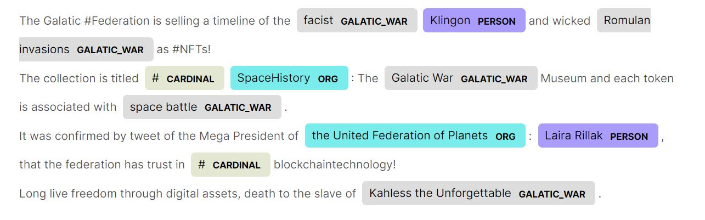

# Classifying Social Media Posts as Hateful using NLP

 <!-- title: Classifying Social Media Posts as Hateful using NLP -->


- [Classifying Social Media Posts as Hateful using NLP](#classifying-social-media-posts-as-hateful-using-nlp)
  - [The NLP Frameworks: SpaCY and Scikit-learn](#the-nlp-frameworks-spacy-and-scikit-learn)
  - [Choosing the Right Dataset](#choosing-the-right-dataset)
  - [Training The NLP Pipelines](#training-the-nlp-pipelines)
- [Applying Named Entity Recognition (NER)](#applying-named-entity-recognition-ner)
- [Conclusion](#conclusion)
  - [References](#references)
  - [Github and Kaggle](#github-and-kaggle)


Say you are going through your favorite sci-fi social network, and you are getting blasted with violent posts shared to your timeline or worse; getting tagged to these.

Now as a peaceful *Trekky*, you don't want this experience, but the platform you are on has double standards in its content moderation and will not act against the will of its Starfleet or Romulan overlords.

So you need to go **rogue**, and take action with the power of NLP.

In this article, we will operate on polarizing posts, scraped from these platforms or provided datasets in public datasets, and utilize NLP to tag these toxic posts.

## The NLP Frameworks: SpaCY and Scikit-learn

**Scikit-learn** is a set of simple tools for predictive data analysis built on NumPy, SciPy, and matplotlib. Luckily for us its, all of it is free and open source.

**SpaCY** is another free framework for NLP, chosen for its simplicity and documentation (given we aren't data scientists yet!).

Generally you'd want to use these frameworks to process large bodies of text (aka corpora), with the intention of:

- Understanding what do the words mean in given context?
- Who is doing what to whom?
- What organizations and products are mentioned in the text?

## Choosing the Right Dataset

We will use a public dataset curated by [HuggingFace](https://huggingface.co/datasets/ucberkeley-dlab/measuring-hate-speechWe), consisting of 39k comments annotated by 7k annotators. The annotators tried to rank toxic these social media posts are.

The dataset classifies the _text_ as follows (with scores):

- **insult** - 0-4, how seriously insulting it is.
- **humiliate** - 0-4, is it trying to humiliate anyone?
- **dehumanize** - 0-4, dehumanizing anyone person or group?
- **violence** - 0-4, how serious the violence is suggested? We will be looking closely at this.
- **genocide** - 0-4, any references to a race in the violence?
- **hatespeech** - General hate sentiment. 0-2 (why not 4? That is what the dataset annotators decided).

In preprocessing, we will normalize these scores to either 1 or 0 (it's violent or not).

```python
import datasets
import pandas as pd

dataset = datasets.load_dataset('ucberkeley-dlab/measuring-hate-speech', 'binary')
df = dataset['train'].to_pandas()
```

## Training The NLP Pipelines

An NLP pipeline has these basic steps:

1. Cleaning - which we have done already on the corpus.
2. Tokenization - Break down of words at points of speech.
3. Vectorization - Convert the words into scalar numbers.
4. Classification - Associate our word vectors with a label to allow prediction to happen.

Or as illustrated below:


Both Spacy and SKT pipelines come ready with components or out-of-the-box pipelines to carry these out.

We start with the text preprocessing to clean this up.

```python
import nltk
nltk.download('wordnet')

import string
import pandas as pd
import swifter
from nltk.stem import WordNetLemmatizer
from nltk.corpus import stopwords

lemmatizer = WordNetLemmatizer()
lemmatizer.lemmatize

stopwords = stopwords.words('english')
punctuation = string.punctuation

categories = ['hatespeech', 'insult', 'violence', 'genocide']

def clean_text(text):
    clean_text = text.lower()
    clean_text = " ".join(x for x in clean_text.split() if x not in stopwords and x not in punctuation)
    clean_text = " ".join(lemmatizer.lemmatize(x) for x in clean_text.split())

    return clean_text

print("Preprocessing text")

df = df[['hatespeech', 'insult', 'violence', 'genocide', 'text']]
df = df.dropna()

df['clean_text'] = df['text'].swifter.apply(lambda x: clean_text(x))

print("Reducing text's features")
df['hatespeech'] = df['hatespeech'].swifter.apply(lambda x: 0 if x <= 1 else 1)
df['insult'] = df['insult'].swifter.apply(lambda x: 0 if x <= 1 else 1)
df['violence'] = df['violence'].swifter.apply(lambda x: 0 if x <= 1 else 1)
df['genocide'] = df['genocide'].swifter.apply(lambda x: 0 if x <= 1 else 1)

df.describe()
```

Followed by the training pipelines.

```python
from sklearn.feature_extraction.text import CountVectorizer
from sklearn.pipeline import Pipeline
from sklearn.model_selection import train_test_split, RepeatedStratifiedKFold
from sklearn.ensemble import RandomForestClassifier
from sklearn.model_selection import GridSearchCV
from sklearn.metrics import accuracy_score
from sklearn.linear_model import SGDClassifier
from sklearn.neural_network import MLPClassifier
from sklearn.ensemble import RandomForestClassifier, StackingClassifier
from sklearn.base import clone

import warnings
warnings.simplefilter('ignore')

rfc = RandomForestClassifier(n_estimators = 500, criterion = "gini", max_depth = 10,
                             max_features = "auto", min_samples_leaf = 0.005,
                             min_samples_split = 0.005, n_jobs = -1)
sgdc = SGDClassifier(loss='hinge', penalty='l2', alpha=1e-3,
                     max_iter=15, tol=None, verbose=False)

bow_vector = CountVectorizer(ngram_range = (1,1), stop_words='english')

estimators = [('sgdc', sgdc), ('rfc', rfc)]
sclf = StackingClassifier(estimators = estimators)

nlp_pipeline = Pipeline([('vectorizer', bow_vector), ('classifier', sclf)])

grid = dict()
cv = RepeatedStratifiedKFold(n_splits=4, n_repeats=2)
categories = ['hatespeech', 'insult', 'violence', 'genocide']
train, test = train_test_split(df, test_size=0.35)
search = GridSearchCV(nlp_pipeline, grid, n_jobs=-1, cv=cv)

models = []
for category in categories:
    print(f'Processing classifier for {category}')

    search_clone = clone(search)
    search_clone.fit(train['clean_text'],  train[category])

    model ={}
    model['category'] = category
    model['model'] = search_clone
    models.append(model)

    prediction = search_clone.predict(test['clean_text'])
    print(f'Processed with accuracy_score {accuracy_score(test[category], prediction)}\n')
```

Now let's test out our trained models on some intergalatic posts, will these be Vulcan in nature (neutral and logical) or plain-old toxic?


```python
import json

f = open('warposts.json')
posts = json.load(f)['posts']
f.close()

sample_text1 = posts[1]
sample_text2 = posts[5]

for model in models:
    model, category = model['model'], model['category']

    prediction = model.predict([clean_text(sample_text1)])
    print(f'category: {category}, predicted: {prediction} for:\n {sample_text1}\n')

    prediction = model.predict([clean_text(sample_text2)])
    print(f'category: {category}, predicted {prediction} for:\n {sample_text2}\n\n')
```
The results being new posts getting classified:
```
category: hatespeech, predicted: [0] for
 The Galatic #Federation is selling a timeline of the facist Klingon and wicked Romulan invasions as #NFTs!
The collection is titled #SpaceHistory: The Galatic War Museum and each token is associated with space battle.
It was confirmed by tweet of the Mega President of the United Federation of Planets: Laira Rillak, that the federation has trust in #blockchaintechnology!
Long live freedom through digital assets, death to the slaves of Kahless the Unforgettable.

category: hatespeech, predicted [0] for:
 If ya ain't human or similar ANNNDDDDD pretty: you need to die, goddam slave. #Wakeup


category: insult, predicted: [1] for:
 The Galatic #Federation is selling a timeline of the facist Klingon and wicked Romulan invasions as #NFTs!
The collection is titled #SpaceHistory: The Galatic War Museum and each token is associated with space battle.
It was confirmed by tweet of the Mega President of the United Federation of Planets: Laira Rillak, that the federation has trust in #blockchaintechnology!
Long live freedom through digital assets, death to the slaves of Kahless the Unforgettable.

category: insult, predicted [1] for:
 If ya ain't human or similar ANNNDDDDD pretty: you need to die, goddam slave. #Wakeup


category: violence, predicted: [0] for:
 The Galatic #Federation is selling a timeline of the facist Klingon and wicked Romulan invasions as #NFTs!
The collection is titled #SpaceHistory: The Galatic War Museum and each token is associated with space battle.
It was confirmed by tweet of the Mega President of the United Federation of Planets: Laira Rillak, that the federation has trust in #blockchaintechnology!
Long live freedom through digital assets, death to the slaves of Kahless the Unforgettable.

category: violence, predicted [1] for:
 If ya ain't human or similar ANNNDDDDD pretty: you need to die, goddam slave. #Wakeup

 ... etc
```

# Applying Named Entity Recognition (NER)

Using spacy, we will look into the posts and see if these have specific entities worth noting.
With NER we can identify the following:

| **Category** | **Description**                                      |
| ------------ | ---------------------------------------------------- |
| PERSON:      | People, including fictional.                         |
| NORP:        | Nationalities or religious or political groups.      |
| FAC:         | Buildings, airports, highways, bridges, etc.         |
| ORG:         | Companies, agencies, institutions, etc.              |
| GPE:         | Countries, cities, states.                           |
| PRODUCT:     | Objects, vehicles, foods, etc. (Not services.)       |
| EVENT:       | Named hurricanes, battles, wars, sports events, etc. |
| WORK_OF_ART: | Titles of books, songs, etc.                         |
| LAW:         | Named documents made into laws.                      |
| DATE:        | Absolute or relative dates or periods.               |
| TIME:        | Times smaller than a day.                            |

To have NER, spacy first needs to download and load its english pipelines, as show below.

```python
import spacy
from spacy import displacy

spacy.cli.download("en_core_web_sm")
nlp = spacy.load("en_core_web_sm")
```

In addition, we can provide some hints in the form of label patterns, to add more classifications to the NER pipeline output:

```python
pattern=["space battle", "evil agenda", "genocide", "#EvilMonarchs", "facist", "Red Matter", "Borg Cubes",  \
        "Klingon invasion", "Romulan invasions", "invasions", "Galatic War", "Kahless the Unforgettable"]

#Create or replace the EntityRuler
if nlp.has_pipe("entity_ruler") and nlp.get_pipe("entity_ruler") is not None:
    nlp.remove_pipe("entity_ruler")

ruler = nlp.add_pipe("entity_ruler", first=True)
for a in pattern:
    ruler.add_patterns([{"label": "GALATIC_WAR", "pattern": a}])

sample_doc1 = nlp(sample_text1)
sample_doc2 = nlp(sample_text2)

displacy.render(sample_doc1, style="ent", jupyter=True)
```

Once we know what to label (in addition to the default categories Spacy offers), we can execute the pipeline on the text and analyze it. Below you can see how spaCY outlines entities within the text:



# Conclusion

We trained models to identify how toxic posts are and we used Spacy to find who is doing these and at who.

With this automated knowledge, we have the power to affect changes to our feed and more. *Live long and Prosper!*

## References

- https://huggingface.co/datasets/ucberkeley-dlab/measuring-hate-speechWe
- https://scikit-learn.org/stable
- https://spacy.io
- https://intl.startrek.com/news/star-trek-stands-with-our-aapi-community

## Github and Kaggle

Article here is also available on [Github](https://github.com/adamd1985/articles/tree/main/nlp_intro) and [Kaggle](https://www.kaggle.com/code/addarm/classifying-social-media-posts-as-hateful-nlp/notebook)

#

<div align="right">Made with :heartpulse: by <b>Adam</b></div>
