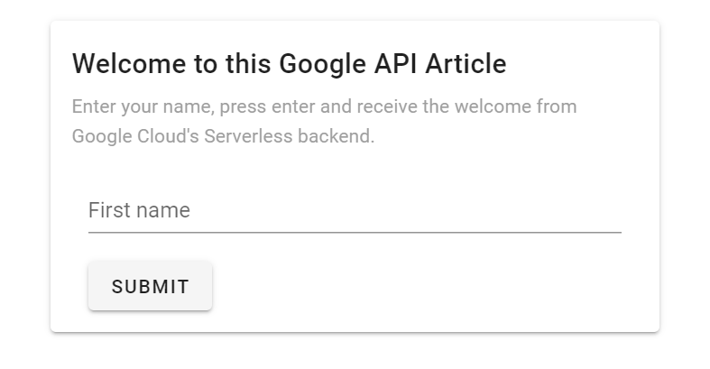
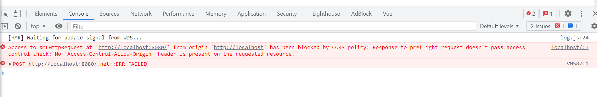
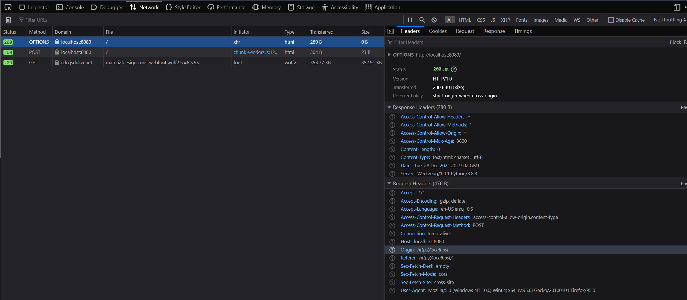
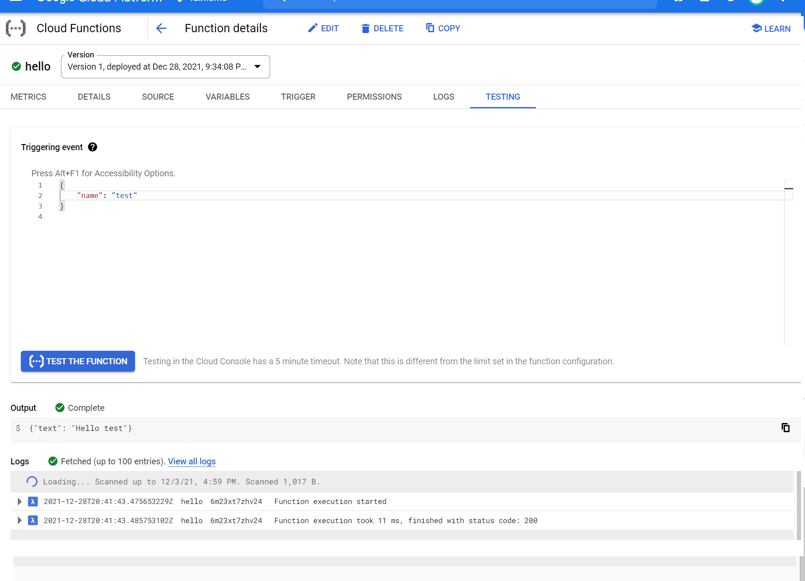
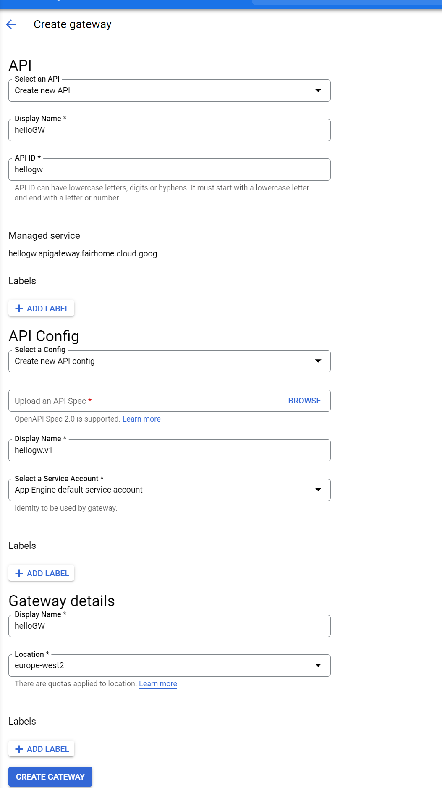
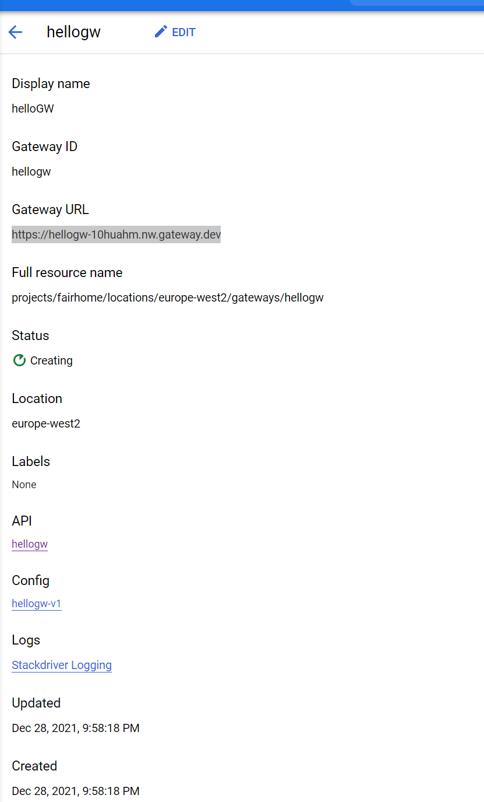
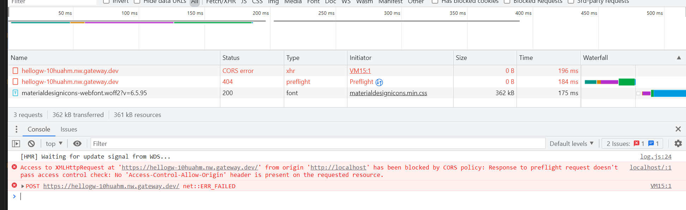
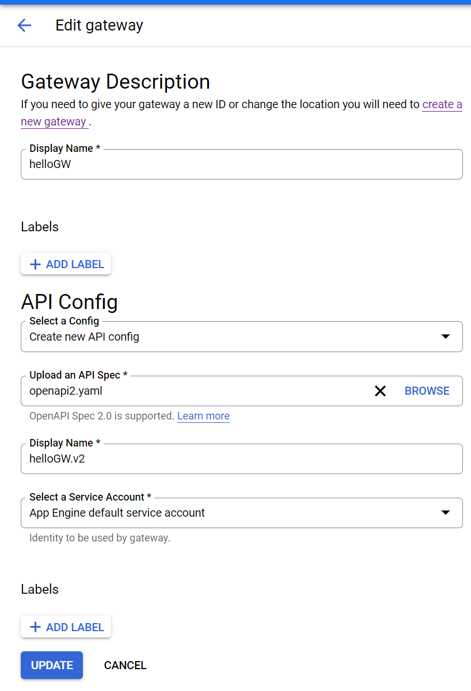

# Create a webapp with CORs and Google API Gateway
 <!-- title: Create a webapp with CORs and Google API Gateway -->
 
 
 
 - [Create a webapp with CORs and Google API Gateway](#create-a-webapp-with-cors-and-google-api-gateway)
  - [Easy Vuejs Setup](#easy-vuejs-setup)
  - [Spin up a Google Cloud Function](#spin-up-a-google-cloud-function)
  - [The first CORs issue](#the-first-cors-issue)
  - [Cloud Function and API Gateway](#cloud-function-and-api-gateway)
    - [Debugging CORs on Google API Gateway](#debugging-cors-on-google-api-gateway)
  - [References](#references)
  - [Github](#github)


Google API Gateway is out, and for those used to AWS or Azure API Gateways, it comes with a serious obstacle: it does not have CORs support!

What you will learn from this article:
- Setup a veujs webapp.
- Create a cloudfunction in Python.
- Create a google API Gateway.
- Define your function with OpenAPI.
- Deploy and test your API Gateway.


## The Vuejs Setup

This is easy: `vue create hello-world`

You will wil get out of the box everything you need. 
What's pertinent to this article is this simple form we created, that takes a name and has a submit button:

```jsx
<v-form ref="form">
  <v-text-field
    v-model="form.name"
    label="First name"
    required
  ></v-text-field>
  <v-btn class="mr-4" @click="submit"> submit </v-btn>
</v-form>
```

The submit will fire off this function:
```jsx
submit() {
  axios
    .post(URL, JSON.stringify(this.form), {timeout: DEFAULT_TIMEOUT})
    .then((response) => {
      this.message = response.data;
    })
    .catch((error) => {
      this.message = error.message;
    })
},
```

Thats really all, run `yarn install` and `yarn serve` and you can see in the browser our simple webapp:



There is more, we want a **backend**, and we want a serverless one in Google Cloud.

## Spin up a Google Cloud Function

First we need to code in the backend, for this exercise we choose a simple python flask backend:

```python
import json
import logging
from flask import Flask, request

app = Flask(__name__)

@app.route("/hello", methods=["POST"])
def hello(request):
    prop = request.get_json()

    if (
        hasattr(request, "headers")
        and "content-type" in request.headers
        and request.headers["content-type"] != "application/json"
    ):
        return (
            json.dumps({"error": f"Unknown content type: {ct}!"}),
            400,
        )
    if prop is None:
        return (
            json.dumps({"error": "No request parameters passed!"}),
            400,
        )

    return (json.dumps({"error": f"Hello {prop.name}"}), 200)
```

Let's test it locally by using google's function frame work: 
- `py -m venv cloudapi`
- `pip install functions-framework flask`

Run it: `functions_framework --target=hello` to get this command line output:

```bash
$ functions_framework --target=hello
 * Serving Flask app "hello" (lazy loading)
 * Environment: production
   WARNING: This is a development server. Do not use it in a production deployment.
   Use a production WSGI server instead.
 * Debug mode: off
 * Running on http://localhost:8080/ (Press CTRL+C to quit)

```

Hitting that url, you will stumble across this error: `{"error": "No request parameters passed!"}`. We need to POST a request with parameters to the API. So let's spinup again our webapp and change the submit button to point to our endpoint: `axios.post("http:localhost//:8080/", JSON.stringify(this.form), {timeout: DEFAULT_TIMEOUT})`

When we input a name and submit, we get this:




## The first CORs issue

Cross-origin resource sharing (CORS) is a whitelist that allows AJAX requests outside your site. In our case, its the webapp and the backend.

We need to enable CORs on the backend side. Let's add these CORS headers:

```python
CORS_HEADERS = {
    "Access-Control-Allow-Origin": "*",
    "Access-Control-Allow-Methods": "*",
    "Access-Control-Allow-Headers": "*",
    "Access-Control-Max-Age": "3600",
}
```


and pass these to each of our returns: `return (json.dumps({"error": f"Hello {prop.name}"}), 200, CORS_HEADERS)`. Flask has `flask_cors` to facilitate this, though for now we will do this step-by-step to understand what happens.

We need to also cater for pre-flight requests using the _OPTIONS_ HTTP command:


```python

@app.route("/hello", methods=["POST", "OPTIONS"])
def hello(request):
  if hasattr(request, "method") and request.method == "OPTIONS":
      return ("", 200, CORS_HEADERS)

  prop = request.get_json()
  #...continue with our original function
```
The browser will initiate a *pre-flight* request before each HTTP request, asking the server what is allowed. The server send over its requirements and what it will accept or reject. The entire exchange will look like this:



With all that out of the way, let's deploy and access our servless function.

## Cloud Function and API Gateway

We can deploy the function using goggle's [SDK](https://cloud.google.com/sdk/docs/quickstart) from the cloudfunction directory and follow the instructions each command gives us:

```bash
gcloud auth login

gcloud config set project [YOUR_PROJECT]

gcloud functions deploy hello --entry-point hello --runtime python38 --trigger-http --region=europe-central2 
```

Navigating to the console's [cloud functions](https://console.cloud.google.com/functions) we will see our new servless function. From here you can test it:



Next we create the [API Gateway](https://console.cloud.google.com/api-gateway). From that screen, click on **Create Gateway**, if this is your first time, it will ask you to enable 3 additional apis.

The next screen you will see is this:



Most options are self-explanatory, with the exception of **API Config**, here we have to draft an OpenAPI Yaml describing our Rest endpoint. For us, this is how it will be:

```yaml
# openapi2-functions.yaml
swagger: "2.0"
info:
  title: Hello
  description: Hello World
  version: 1.0.0
schemes:
  - https
produces:
  - application/json
paths:
  /hello:
    post:
      summary: Hello World
      operationId: hello
      x-google-backend:
        address: https://europe-central2-fairhome.cloudfunctions.net/hello
      consumes:
        - application/json
      parameters:
        - in: body
          name: name
          description: To whom we will say hello.
          schema:
            type: object
            required:
              - name
            properties:
              name:
                type: string
      responses:
        200:
          description: Hello string
          schema:
            type: object
            properties:
              text:
                type: string
                description: hello world.
        400:
          description: Bad request
          schema:
            type: object
            properties:
              error:
                type: string
                description: The error message
        500:
          description: Internal error
          schema:
            type: object
            properties:
              error:
                type: string
                description: The error message
```

Creating a new gateway takes some time, while waiting for it you can explore the OpenAPI editor we provided in the references.
Once the creation is complete, go the the gateway tabs and you should see this information:



Now we update the url of our webapp to include the above url `axios.post("[http:localhost//:8080/](https://hellogw-10huahm.nw.gateway.dev)", JSON.stringify(this.form), {timeout: DEFAULT_TIMEOUT})` and serve it again.

And we get another CORS error!



### Debugging CORs on Google API Gateway

Given that the API Gateway is fairly new, there is no CORs support.

But, when we access the cloud [logs](https://console.cloud.google.com/logs/) we see some interesting logs:

```yaml
httpRequest: {9}
insertId: "dc644df6-2e56-477b-8379-269b1b2109364850908905639612439@a1"
jsonPayload: {
api_key_state: "NOT CHECKED"
  api_method: "<Unknown Operation Name>"
  http_status_code: 404
  location: "europe-west2"
  log_message: "<Unknown Operation Name> is called"
  producer_project_id: "fairhome"
  response_code_detail: "direct_response"
  service_agent: "ESPv2/2.32.0"
  service_config_id: "hellogw-v1-0pn23yr7zx6qy"
  timestamp: 1640725343.72118
}
logName: 
```

API Gateway is built on Google's ESP endpoints. This means we can configure the end points to pass-through CORs requests to the backend, in this case our python servless function, which has been created to handle CORs out of the box (and the reason we didn't use `flask_cors`).

We add the google endpoints config to the API:
```yaml
produces:
  - application/json
  ...
x-google-endpoints:
- name: https://hellogw-10huahm.nw.gateway.dev
  allowCors: True
  ...
paths:
```

We include the OPTIONs endpoint we originally created:
```yaml
  options:
      operationId: corsHello
      x-google-backend:
        address: https://europe-central2-fairhome.cloudfunctions.net/fairhouse
      responses:
        '200':
          description: A successful response
```

Update the API gateway config with the new OpenAPI yaml.



Run again the webapp and you are all done. You have integrated your webapp to a google api and its serverless backend.

## References

- [Quick Vuejs setup](https://cli.vuejs.org/guide/creating-a-project.html)
- [Cloud Functions](https://developers.google.com/learn/topics/functions)
- [Flask Quickstart](https://flask.palletsprojects.com/en/2.0.x/quickstart)
- [Cross-Origin Resource Sharing (CORS)](https://developer.mozilla.org/en-US/docs/Web/HTTP/CORS)
- [OpenAPI and swagger editor](https://editor.swagger.io/)

## Github

Code and article shown here are available on [github](https://github.com/adamd1985/articles/tree/main/nodewebapp_GCE_apigateway).

#
<div align="right">
<p xmlns:cc="http://creativecommons.org/ns#" xmlns:dct="http://purl.org/dc/terms/"><a property="dct:title" rel="cc:attributionURL" href="#">This Article</a> by <a rel="cc:attributionURL dct:creator" property="cc:attributionName" href="https://www.linkedin.com/in/adam-darmanin/">Adam Darmanin</a> is licensed under <a href="http://creativecommons.org/licenses/by-nc-sa/4.0/?ref=chooser-v1" target="_blank" rel="license noopener noreferrer" style="display:inline-block;">CC BY-NC-SA 4.0</a></p>
</div>