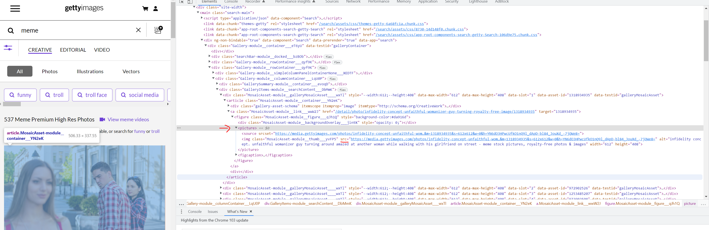

# Scrape Your Way to Data
 <!-- title: Scrape Your Way to Data -->

- [Scrape Your Way to Data - as a Startup](#scrape-your-way-to-data---as-a-startup)
- [Scraping and Selling](#scraping-and-selling)
  - [Eyeballing a Website](#eyeballing-a-website)
  - [Scaffolding Scraping](#scaffolding-scraping)
  - [Injesting Scraped Crumbs](#injesting-scraped-crumbs)
  - [Can I have Some More Scraps?](#can-i-have-some-more-scraps)
- [Difficulties in Scraping](#difficulties-in-scraping)
- [Conclussion](#conclussion)
  - [References](#references)
  - [Github](#github)


In this article, we will get an insight on the core process of every 'meme data startup' out there - the **Web Scraper**.

More precisely the python web scraper: *Scrapy* and it's HTML parser: *Beautiful Soup*, along with an html expression language for selecting elements called *XPath*.

# Scraping and Selling

Scraping is an automated process of gathering information from the Internet.

Why automated? 

Think of how repetitive it is to search for an item in your favorite webstore: all that clicking, scrolling, reading, redirection etc. This is not a viable process selling data at an industry-level to your meme data startup clients. And, if you are an engineer at heart, you know how bad repetitive manual work is - so we code in a web scraper to automatically injest all that data.

Be warned though, that constant maintenance is key to a scraper, given how fluid the internet is. That is why eventually you want to move your scrappy meme scraping startup to work with data vendors and data apis.

## Eyeballing a Website

What's the best place to get some meme material to sell? *[gettyimages.com with memes](https://www.gettyimages.com/search/2/image?family=creative&phrase=meme)*.

We want to create a database of meme images, but we need every meme image and its url out there. Let's analyze it at an HTML level:


Looking at that code, we see that the **<picture>** tag encapsulates exactly what we want and from the **** tag, we have the source of the image to grab and save in our DB.

## Scaffolding Scraping

Create an environment (always create an environment when working with python):

`conda create -n gettyscrapy python=3.8 -y`
`conda activate gettyscrapy`

Install the required packages:

`conda install scrapy beautifulsoup4 pysqlite3 -y`

Quickstart a scraping project:
`scrapy startproject the_scraper_projectname`

This will generate a *Scrapy* project in this format:

- the_main_dir
  - the_scraper_projectname
    - *settings.py* - parameters for scrapers and runners, e.g multithreading, bot name, respect robot.txt guidelines, etc.
    - *items.py* - the structured data coming out of a scraper.
    - *middleware.py* - additional functionality provided by scrapy or hooks in various stages of the lifecycle.
    - *pipeline.py* - glueing everything togther and persisting the data somewhere.
    - *spiders* - where are scrapers are located
      - *spider1.py*
  - *scrapy.cfg* - Holds important variables for a scrapy deployment, e.g. project name and configuration file path.

And finally, quickstart a *spider* to *crawl* the site:

`scrapy genspider -t crawl gettyimages 'https://www.gettyimages.com/search/2/image?family=creative&phrase=meme'`

Which will generate this code:

```python
class GettyImagesSpider(CrawlSpider):
    name = "gettyimages"
    start_urls = ['https://www.gettyimages.com/search/2/image?family=creative&phrase=meme']


    def __init__(self, topic, *args, **kwargs):
        """Constructor"""

    def parse(self, response):
        """Image processor"""         
```

Exciting isn't it, we have a script that can browse for you with this command:

`scrapy crawl gettyimages`

But **WAIT**, before running a scraper, understand some rules of engagment to be a good scraper and not a data stealing villian:
- Don't be a burden to the site's infrastructure - i.e. don't **DDOS** the site.
- Respect the **robots.txt** - follow the delays and guidelines defined here.
- Don't violate copyright - The images we are scraping are royalty free (not that it ever stopped any 'high' growth startup).
- Don't breach GDPR (unless you are a startup outside of that jurisdiction, then goodluck for those whose data was breach).

Now you can run the spider, it will just output the HTML in the console

## Injesting Scraped Crumbs

Back to our website analysis, this is the HTML we will work with:

```html
<figure class="MosaicAsset-module__figure___qJh1Q" style="background-color:#da916d">
  <picture>
    <source srcset="https://media.gettyimages.com/photos/infidelity-concept-unfaithful-womanizer-guy-turning-around-amazed-at-picture-id1318934935?k=20&amp;m=1318934935&amp;s=612x612&amp;w=0&amp;h=YN6dO3HPwcUfkO1nQ9l_dApD-bl84_JouXd_-7jQWe8=">
    
  </picture>
    <figcaption>infidelity concept. unfaithful womanizer guy turning around amazed at another woman while walking with his girlfriend on street - meme stock pictures, royalty-free photos &amp; images</figcaption>
</figure>
```

Using **BeautifulSoup**, let's parse the page's HTML to get the images' url, this will be done using **XPath**:

```python
xpath_sel = response.xpath("//picture").
              xpath("img/@src")

```

Xpath will select all the **picture** tags, from the root of the document which is signalled through the use of characters **'//'**. From there, look into every **img** tag and compose a list of urls from the src attribute, done with the selector: **@src**.

Next, create a dictionary and **yield** it to the collector running this spider: 

```python
urls = img.getall()
if urls is not None and len(urls) != 0:
    for url in urls:
        yield {'url': url}
```

The crawler will **pipeline** this list of **items** it collected from the spiders, into the sqlite database we prepared and append a row therein:
```python
class SpiderPipeline(object):
    def open_spider(self, spider):
        # called when the spider is opened
        self.con = sqlite3.connect('urls.db')  # create a DB
        self.cur = self.con.cursor()
        self.cur.execute(
            '''DROP TABLE IF EXISTS urls''')  # drop table if already exists
        self.cur.execute('''CREATE TABLE urls (url)''')  # create a table
        self.con.commit()

    def close_spider(self, spider):
        # called when the spider is closed
        self.con.close()

    def process_item(self, item, spider):
        # called for each item crawled from spiders/quotes-spiders.py
        # insert the each item crawled into DB
        self.cur.execute(
            "INSERT INTO urls (url) VALUES( '" + item['url'] + "')")
        self.con.commit()
        return item
```

The **item** here is a simple dictionary, though it can be decorated or processed through the Item class:

```python
class Item(Item):
    pass # just a passthrough with no change.
```

## Can I have Some More Scraps?


The getty images page has more pages, 52 at the time of writing this article. We need a method to get the next page.

Observe the URL: *https://www.gettyimages.com/photos/meme?assettype=image&phrase=meme&sort=mostpopular&license=rf%2Crm&page=2*. There is a url path element that define what **Page** we are looking at.
Let's programmatically grab it:

```python
parsed_url = urlparse(response.request.url)
captured_value = parse_qs(parsed_url.query)
page = 1 if captured_value is None or 'page' not in captured_value else int(
    captured_value['page'][0]) + 1
```

With the library **urllib**, we can wrap the url in an actionable object and parse the query string in it using **parse_qs**. Parse_qs will return a tuple with the element and its value.

From here, we can signal to scrapy's crawler to take us to another page:
```python
abs_url = re.sub('page=\d', f'page={page}', response.request.url)
max_pages = xpath_sel = response.xpath(
    "//span[@class =  'PaginationRow-module__lastPage___k9Pq7']/text()"
).get()

if max_pages is not None and len(max_pages) > 0 and int(max_pages) >= page:
    yield Request(
        url=abs_url,
        callback=self.parse
    )
```

Yielding a **Request** object, will run the spider on the new page provided in the returned URL. Note that we scrape the maximum number of pages, not to send our crawler to sites that are beyond our scope or don't exist. The HTML we are looking at is this:

```html
<section class="PaginationRow-module__container___LxZJN">
  <input type="text" maxlength="999" class="PaginationRow-module__input___VqORp" autocomplete="off" name="page" value="2"> of <span class="PaginationRow-module__lastPage___k9Pq7">52</span>
</section>
```

# Difficulties in Scraping

- The Web grows organically, changes constantly and is a hot mess. You scraper needs to be updated often - or switch to **APIs** if the site offers these.
- Each website - and sometimes the pages within - is unique and will need custom code to scrape.
- Durability - Given that sites change often and without warning, your scraper has to fail gracefully and often. 

Scraping is a lot of effort and maintenance.

# Conclussion

In this article, we automated the browsing of a site, through the use of python's *scrapy*, *beautifulsoup* and *xpath*.

Scraping is used to collect data, in this case for our fictional meme startup, and further process it down the line. Use the code in this article to build your own or apply to one - it's a common interview question.

When scraping, always be fair and respectful to sites that you are crawling through, and follow the guidelines in **robots.txt**!

## References

- https://docs.scrapy.org/
- https://beautiful-soup-4.readthedocs.io
- https://www.w3schools.com/xml/xpath_syntax.asp
- https://www.gettyimages.com/

## Github

Article is available on [Github](https://github.com/adamd1985/articles/edit/main/scrapeyourway_todata) and its sample scraper can be forked from this other [repo](https://github.com/adamd1985/gettyimages-scraper)

#

<div align="right">Made with :heartpulse: by <b>Adam</b></div>
