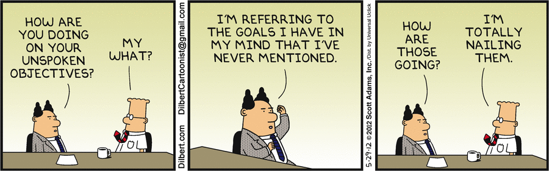

# Are your Goals Smart?

 <!-- title: Are your Goals Smart? -->
 
 

 - [Are your Goals Smart?](#are-your-goals-smart)
  - [The Goals we Know](#the-goals-we-know)
  - [Anatomy of a Goal](#anatomy-of-a-goal)
    - [Specific](#specific)
    - [Measurable:](#measurable)
    - [Achievable](#achievable)
    - [Relevant](#relevant)
    - [Time-bound](#time-bound)
  - [Visible Work Agreements](#visible-work-agreements)
  - [References](#references)
  - [Github](#github)
 
## The Goals we Know

Say you are in the sprint planning, and you get this assigned:

`Refactor this lib, make it better.`


This story, can only be described in here in this Dilbert panel - a shovel full of arbitrary assignments.

 

Why is this not a meaningful piece of work? There is no goal at all. 

- It doesn't explain the why it is needed, beyond an anecdote. 
- It is not specific, doesn't tell us what exactly it wants. 
- Doesn't tell us when is it ready, this makes it open to everyone's interpretation.
  
With these gaps in mind, let's challenge the story and ask our Product Owner to define it better, which they do when they come with this:

```text
The lib has a lot of unused code, is hard to read, and has complex hierarchies.

We use it to schedule jobs, but because it’s obscure and error prone, it forces our team to use less efficient substitutes.

If we can have everyone use our library within this quarter, this will reduce our dependencies and improve our job scheduling for our new business initiative. 

As a developer maintaining this library, do you think we can do this?
```

This is a better goal to undertake, because it is:

- **Specific** - What it is, Why we need it and Who it affects.
- **Measurable** - We listed quantifiable gaps to fill (unused code, complex object hierarchies, adoption). We know its ready when 100% adoption rate is achieved.
- **Achievable** - PO is asking feedback from the implementers. The people that will work on these objectives are the ones to give the right feedback to create good goals.
- **Relevant** - There is a new business initiative (we have motivation), the PO is asking the  right person - engineer, and it fit our culture of  constant improvement which boost teams’ developer experience.
- **Time-Bound** - Within the quarter, but also the PO is asking the implementers to estimate the steps required and lock them in the coming sprints.


The above make up the building blocks of **SMART** goals. 

What about this one:

`I want 1 billion users on my app within the next 3 years, so my company is ranked top 1% in the industry…`

 

An objective that would have been set by Dilbert's psychopathic character: Catbert.

...and Catbert would be correct in this goal, because it fits the SMART criteria.

Yet such a goal should not be given, nor undertaken:

- There is nothing in it for you or your teams. It only benefits the goal setter's ego.
- No greater goal. Just being the best is not a concrete goal, but a journey.
- Lots of assumptions. 1 Billion, that is 1/7th of the world! Maybe its possible; Facebook did reach 3 billion users in 13 years - but it's too far of a moonshot.

## Anatomy of a Goal

### Specific

- What do I want to accomplish?
- Why is this goal important?
- Who is involved?
- What are the resources or constraints?


**Example:**

*I want to shift our service to Kubernetes, so that we can reduce our maintenance efforts and set a stage for faster feature developments.*

### Measurable:

- How much?
- When is it done?


**Example:**

*We have 10APIs, a message bus and a noSQL Database.*

*We will need fundamental training in Kubernetes and HELM.*

*It’s done when we achieve our training and our components have been shifted to a managed cluster.*

### Achievable

- How can we accomplish this goal?
- How realistic is the goal?
  
**Example:**

*We will need financial go-ahead for the use of infrastructure that supports Kubernetes. With this done, it’s achievable in half a year*.

### Relevant

- Is it worthwhile? 
- Does this match our other efforts/needs?
- Are we the right people to reach this goal?


**Example:**

*Our service is a business critical component that is part of a larger business initiative and will require new development.* 

*Given we our organization is reducing costs, shifting to these managed services will happen at the right time.*

### Time-bound

- When?


**Example:**

*By breaking down the milestones into quantifiable tasks and locking these into 2 weeks iterations, we estimate it would take 6 months with 70% confidence.*

## Visible Work Agreements

Think of these SMART goals as contracts. If you were a contractor, you would want to set the scope of your work, the resources needed, timelines, completion criteria and when to get paid.

Why is your company work any different? Don't be like Dilbert here, you're smarter than this

 

## References

- [Dilbert's Comic Strip](https://dilbert.com)
- [Dilbert's wiki](https://dilbert.fandom.com/wiki)

## Github

Code and article shown here are available on [github](https://github.com/adamd1985/articles/tree/main/smart_goals).

#
<div align="right">Made with :heartpulse: by <b>Adam</b></div>
